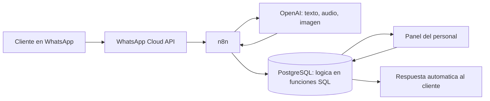

# Hola, soy Hebert

---

##  Sobre mí

Desde que aprendí a programar me pasa siempre lo mismo: veo a alguien haciendo algo repetitivo a mano y no puedo dejar de pensar en cómo hacer que eso se haga solo.

No empecé a hacerlo por trabajo. Lo hago porque me gusta ver funcionando algo que antes no existía, y porque cuando un negocio chico deja de perder horas en tareas tontas, se nota de verdad.

Estudio Ingeniería de Sistemas en Piura y me paso la mayor parte del tiempo construyendo cosas por mi cuenta, rompiéndolas y volviéndolas a armar.

**Ahora ando metido en:**

- Bots de WhatsApp que conversan, agendan y confirman sin que nadie conteste
- Conectar herramientas que no se hablaban entre sí
- Aprender a meter modelos de IA dentro de un flujo sin que puedan romper nada
- Páginas que carguen rápido de verdad, no solo en la demo

---

##  Tecnologías que uso con frecuencia

---

##  Cosas que he construido

Todas empezaron igual: alguien haciendo a mano algo que la computadora podía hacer sola.

 

**[Jaguar](https://github.com/HebertCG/Automatizacion_Jagguar)** · [ver demo](https://automatizacion-jagguar.vercel.app)
Un taller de detailing perdía las consultas que llegaban de madrugada y tardaba diez mensajes en cerrar una cita. Ahora un bot atiende solo, entiende audios y fotos, y el personal ve todo desde un panel con agenda y métricas.

**[Guido's](https://github.com/HebertCG/Automatizacion_Guidos)**
Un delivery donde los pedidos solo existían dentro del chat y alguien revisaba los vouchers de Yape a ojo en plena hora pico. Le armé una máquina de estados, lectura automática de vouchers y una pantalla de cocina que se actualiza sola.

**[Tayanti](https://github.com/HebertCG/Automatizacion_Tayanti)**
Un restaurante que solo tomaba reservas en horario de atención y las copiaba a mano a un Excel. Ahora las recibe a cualquier hora y quedan ordenadas sin que nadie las transcriba.

 

**[The North of Oncopathology](https://github.com/HebertCG/thenorthofoncopathology)** · [ver sitio](https://thenorthofoncopathology-coral.vercel.app)
Una red de patología oncológica con seis sedes en el Perú. Lo entretenido acá fue que la página tenía que hablarle a tres personas distintas a la vez: el paciente, el médico que deriva y la institución.

**[Dr. Fabio Palacios](https://github.com/HebertCG/FabioPalacios)** · [ver sitio](https://fabiopalacios.cornejogarciahebertjose.workers.dev)
La página de un cirujano oncólogo de Piura. Toda ella existe para responder una sola pregunta que se hace su paciente: *"¿tengo que viajar a Lima para operarme?"*.

---

##  Cómo funciona por dentro

Uso más o menos la misma arquitectura en los tres proyectos de automatización, y la voy afinando en cada uno:

Lo que más me gustó descubrir de todo esto es dónde conviene poner las reglas: van en la base de datos, no en el modelo de IA. Así el bot puede equivocarse hablando, pero nunca puede romper los datos.

---

### Siempre ando construyendo algo

Si te dio curiosidad algo de acá o quieres conversar de código, por aquí ando.

  

