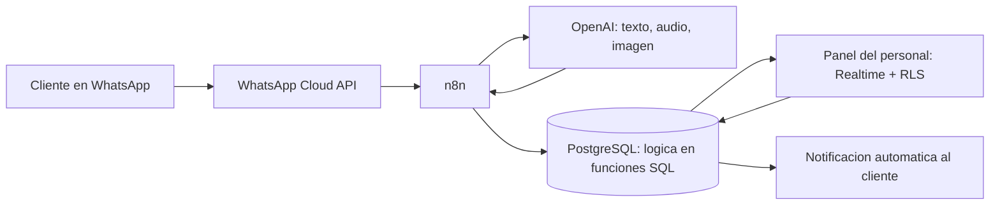

<h1>🤖⚙️</h1>

<h1>Hola, soy Hebert Cornejo</h1>

🚀 Automatizador de Procesos &nbsp;|&nbsp; 🌐 Desarrollador Web Freelance &nbsp;|&nbsp; 🇵🇪 Desde Piura, Perú

---

## 🎯 Sobre mí

Me dedico a que la gente deje de copiar y pegar cosas a mano. 🙂

✨ Si un negocio tiene a tres personas transcribiendo pedidos de WhatsApp a un Excel, ahí hay un problema que se resuelve con código — y esa es justo la parte que más me gusta.

🇵🇪 Trabajo como freelance desde Piura con restaurantes, delivery, talleres de autos y consultorios médicos. Nada de proyectos de práctica: todo lo que hay acá está corriendo con clientes de verdad.

🔍 **Actualmente enfocado en:**

- 🤖 Bots de WhatsApp que reservan, cotizan y confirman solos, sin que nadie conteste
- 🔗 Conectar herramientas que no se hablaban entre sí, con n8n y APIs
- 🧠 Meter modelos de IA dentro de los flujos sin que puedan romper nada
- ⚡ Landing pages que cargan rápido de verdad, no solo en la demo

---

## 💻 Tecnologías que uso con frecuencia

### 🤖 Automatización

  
  
  
  
  
  

### 🌐 Web e infraestructura

  

---

## 🎮 Misión actual: que ningún negocio siga haciendo a mano lo que puede hacer solo

Cada repo de acá es un negocio real que dejó de perder horas. 🎯

📁 **[Automatizacion_Jagguar](https://github.com/HebertCG/Automatizacion_Jagguar)** · [🔴 demo en vivo](https://automatizacion-jagguar.vercel.app)
Un taller de detailing perdía consultas de madrugada y tardaba 10 mensajes en cerrar una cita. Ahora hay 8 workflows de n8n, un bot de 64 nodos que entiende texto, audio e imágenes, y un panel con CRM, métricas y agenda. Los plantones se acabaron pidiendo 20% de adelanto. 🚗

📁 **[Automatizacion_Guidos](https://github.com/HebertCG/Automatizacion_Guidos)**
Un delivery donde los pedidos solo existían dentro del chat y alguien revisaba los vouchers de Yape a ojo en plena hora pico. Ahora hay una máquina de 7 estados en PostgreSQL, OCR que lee los vouchers, pantalla de cocina en tiempo real y una app aparte para el motorizado. 🛵

📁 **[Automatizacion_Tayanti](https://github.com/HebertCG/Automatizacion_Tayanti)**
Un restaurante que solo tomaba reservas en horario de atención y las copiaba a mano. Ahora un bot atiende 24/7 con memoria de conversación, y el personal ve todo en un panel con KPIs del día. 🍽️

---

## 🌐 Y también hago webs

📁 **[thenorthofoncopathology](https://github.com/HebertCG/thenorthofoncopathology)** · [🔗 en vivo](https://thenorthofoncopathology-coral.vercel.app)
Red de anatomía patológica oncológica con 6 sedes en el Perú. El reto era hablarle a tres públicos a la vez —pacientes, médicos que derivan e instituciones— así que el formulario los separa desde el inicio.
`React 18` `TypeScript` `Vite` `Tailwind` `Playwright`

📁 **[FabioPalacios](https://github.com/HebertCG/FabioPalacios)** · [🔗 en vivo](https://fabiopalacios.cornejogarciahebertjose.workers.dev)
Landing de un cirujano oncólogo en Piura. Toda la página existe para responder una sola pregunta: *"¿tengo que viajar a Lima para operarme?"*.
`Angular 22` `TypeScript` `Prerender` `Cloudflare Workers`

---

## 🧠 Cómo funciona por dentro lo que construyo

Uso la misma arquitectura en los tres proyectos de automatización, y la voy afinando en cada uno:

💡 **El truco está en dónde vive la lógica:** todas las reglas del negocio están en funciones de PostgreSQL, no en el modelo de IA ni en el navegador. Así el bot puede equivocarse hablando, pero nunca puede romper los datos.

---

## 🤝 ¿Trabajamos juntos?

📌 Primero un **diagnóstico gratis**: reviso tu proceso y te digo con honestidad si vale la pena automatizarlo. A veces la respuesta es que no. 🤷

📌 Después un **prototipo funcionando** antes de que pagues todo.

📌 Y al final una **entrega documentada**, para que puedas seguir sin depender de mí.

---

⚙️ Automatizando desde **Piura (Perú)** 🇵🇪 para donde haga falta 🌎

✨ *Si lo haces dos veces a mano, probablemente se puede automatizar* ✨

